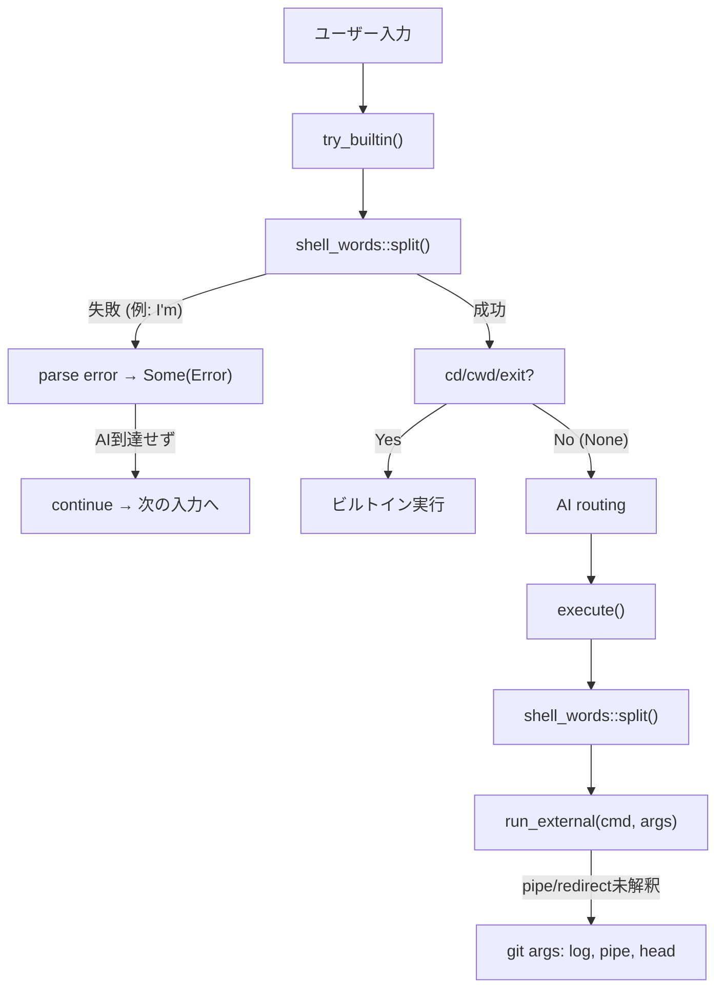

# パーサー処理の修正 (#1 アポストロフィ / #2 パイプ / #3 リダイレクト)

## 現状の問題

現在の入力処理フローは以下の通り:




**根本原因**:

- `try_builtin()` が `shell_words::split()` を**全入力に対して**呼び出し、パースエラーで `Some(Error)` を返すため、自然言語がAIに到達しない (`[src/engine/mod.rs](src/engine/mod.rs)` L71-78)
- `execute()` がトークンをフラットな `Vec<String>` として扱い、`|` や `>>` をリテラル引数として渡す (`[src/engine/mod.rs](src/engine/mod.rs)` L118-134)

---

## 修正方針

### Fix #1: `try_builtin()` のアポストロフィ問題

**方針**: `shell_words::split()` の前に、先頭ワードがビルトインかを軽量チェック。ビルトインでなければ即座に `None` を返し、AI ルーティングに進む。

**変更箇所**: `[src/engine/mod.rs](src/engine/mod.rs)` の `try_builtin()`

```rust
pub fn try_builtin(input: &str) -> Option<CommandResult> {
    let input = input.trim();
    if input.is_empty() {
        return Some(CommandResult::success(String::new()));
    }

    // 先頭ワードがビルトインでなければ即 None → AI に回す
    let first_word = input.split_whitespace().next().unwrap_or("");
    if !matches!(first_word, "cd" | "cwd" | "exit") {
        return None;
    }

    // ビルトインのみフルパース
    let tokens = match shell_words::split(input) {
        // ... 既存ロジック
    };
    // ...
}
```

これにより `I'm tired, Jarvis.` は先頭が `I'm` → ビルトインではない → `None` → AI ルーティングへ。

---

### Fix #2 & #3: パイプとリダイレクトの実装

**方針**: 新しい `parser.rs` モジュールを追加し、トークン列を構造化された `Pipeline` に変換する。`execute()` と `exec.rs` を更新してパイプライン実行とリダイレクトをサポートする。

#### (A) 新規: `[src/engine/parser.rs](src/engine/parser.rs)`

トークン列をパイプ `|` で分割し、各セグメントからリダイレクト演算子を抽出する。

```rust
/// 出力リダイレクト
pub enum Redirect {
    StdoutOverwrite(String), // > file
    StdoutAppend(String),    // >> file
    StdinFrom(String),       // < file
}

/// パイプラインの1セグメント
pub struct SimpleCommand {
    pub cmd: String,
    pub args: Vec<String>,
    pub redirects: Vec<Redirect>,
}

/// パイプラインで接続された一連のコマンド
pub struct Pipeline {
    pub commands: Vec<SimpleCommand>,
}

/// トークン列をパイプラインにパースする
pub fn parse_pipeline(tokens: Vec<String>) -> Result<Pipeline, String> {
    // 1. tokens を "|" で分割
    // 2. 各セグメントから >, >>, < を抽出して Redirect に
    // 3. 残りを cmd + args として SimpleCommand に
}
```

#### (B) 更新: `[src/engine/exec.rs](src/engine/exec.rs)`

- `run_pipeline(pipeline: &Pipeline) -> CommandResult` を追加
  - 単一コマンド: 既存の `run_external` ロジック + リダイレクト対応
  - 複数コマンド: `os_pipe` で前段のstdoutを次段のstdinに接続
  - 最終段の stdout/stderr のみキャプチャ (tee パターン維持)
- リダイレクトの処理:
  - `>` / `>>`: `File::create` / `File::options().append(true).open()` で stdout を差し替え
  - `<`: `File::open` で stdin を差し替え


#### (C) 更新: `[src/engine/mod.rs](src/engine/mod.rs)`

`execute()` のフローを変更:

```rust
pub fn execute(input: &str) -> CommandResult {
    let tokens = shell_words::split(input)?;
    let expanded = tokens.into_iter().map(expand::expand_token).collect();
    let pipeline = parser::parse_pipeline(expanded)?;
    exec::run_pipeline(&pipeline)
}
```

---

## テスト方針

- `parser.rs`: パイプ分割、リダイレクト抽出、エッジケースの単体テスト
- `exec.rs`: `echo hello | cat`、`echo hello > /tmp/test`、`cat < /tmp/test` の統合テスト
- `mod.rs`: アポストロフィ含む入力が `try_builtin` で `None` を返すことのテスト

