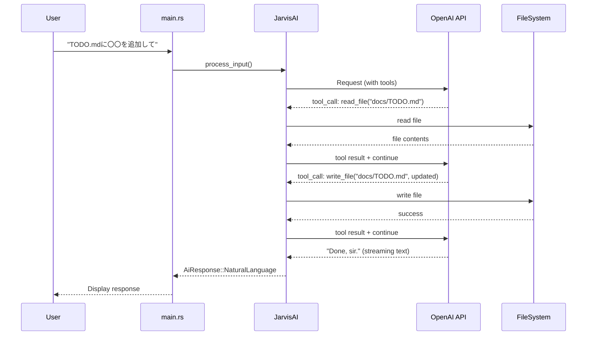

# Jarvis AI 強化計画 (TODO #8)

## 現状の問題

[src/ai/client.rs](src/ai/client.rs) において:

- モデルが `gpt-4o-mini` (L33) で、複雑なタスクの推論力が不足
- ツールが `execute_shell_command` 1つのみ (L270-292)
- **1回のAPI呼び出しで完結する設計** — ファイルを読んでから書くといった複数ステップの操作ができない
- システムプロンプト (L35-48) にファイル操作やMarkdownの文脈理解に関する指示がない

## 改善方針




## 変更箇所

### 1. モデル変更 (`src/ai/client.rs`)

```rust
// Before
const MODEL: &str = "gpt-4o-mini";
// After
const MODEL: &str = "gpt-4o";
```

### 2. ファイル操作ツール追加 (`src/ai/client.rs`)

2つの新しいツールを定義する:

- `**read_file**`: ファイルパスを受け取り、内容を返す
- `**write_file**`: ファイルパスと内容を受け取り、ファイルを書き込む

既存の `shell_command_tool()` (L270) と同様の形式で `read_file_tool()`, `write_file_tool()` を追加。`tools` ベクタ (L104) に3つのツールを登録する。

### 3. エージェントループ実装 (`src/ai/client.rs`)

`process_input()` メソッド (L73-267) を大幅にリファクタリング:

- 会話履歴を `Vec<ChatCompletionRequestMessage>` で管理
- ストリーム処理後、ツール呼び出しがあれば:
  1. アシスタントメッセージ（tool_calls付き）を会話履歴に追加
  2. 各ツールをローカルで実行（`read_file` → `std::fs::read_to_string`, `write_file` → `std::fs::write`）
  3. ツール結果メッセージ（role: tool）を会話履歴に追加
  4. 新しいAPIリクエストを送信（ストリーミング）
  5. 繰り返し（最大10ラウンドの上限付き）
- ツール呼び出しがなければ、テキスト応答を返す
- `execute_shell_command` は従来通り `AiResponse::Command` として main.rs に返す

ストリーム処理のリファクタ:

- 現在の一枚岩の処理を `process_stream()` メソッドに分離
- エージェントループ内で繰り返し呼べるようにする

### 4. システムプロンプト更新 (`src/ai/client.rs`)

L35-48 のシステムプロンプトを拡張:

- `read_file` / `write_file` ツールの使い方を説明
- **ファイル編集のベストプラクティス**: まず `read_file` で読んでから `write_file` で書く
- **Markdown の文脈理解**: `- [ ]` チェックボックス、見出し、番号付きリストなどの構造を理解して適切に追記する指示
- CWD からの相対パスで操作することを明記

### 5. main.rs の変更

[src/main.rs](src/main.rs) は最小限の変更:

- `AiResponse` の型は変更なし（`Command` / `NaturalLanguage` のまま）
- ファイル操作は AI クライアント内で完結するため、main.rs の REPL ループはほぼそのまま
- ファイル書き込み成功時のログ出力を追加する程度

### 6. 必要な追加 import

`async-openai` の以下の型を追加で使用:

- `ChatCompletionRequestAssistantMessage` — アシスタントメッセージ（tool_calls付き）
- `ChatCompletionRequestToolMessage` — ツール結果メッセージ
- `ChatCompletionMessageToolCall`, `FunctionCall` — ツール呼び出しの構造体

## 注意事項

- **コスト増加**: `gpt-4o` は `gpt-4o-mini` より高コスト。さらにエージェントループにより1リクエストあたりの API 呼び出し回数が増える
- **安全性**: 初期実装ではファイル書き込みの確認プロンプトは省略。将来的に追加を検討
- **ループ上限**: 無限ループ防止のため、最大10ラウンドのハードリミットを設定
- **スピナー表示**: エージェントループ中のスピナー表示制御を適切に行う（ツール実行中は進捗表示）
- L126 の `tokio::time::sleep(2秒)` はデバッグ用の残骸なので削除

