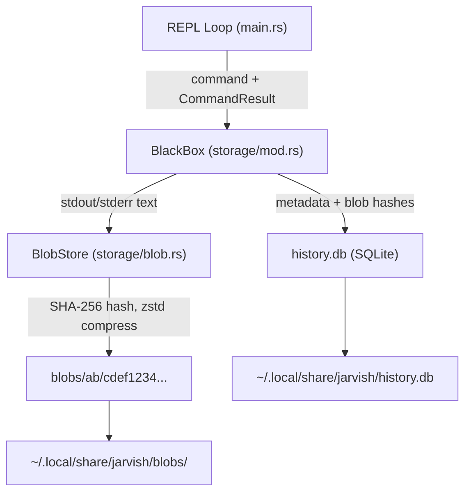

# Phase 2: The Black Box (Persistence) 実装プラン

## 概要

コマンド実行結果（stdout/stderr）を Git のようなコンテンツアドレッサブルストレージに保存し、SQLite でメタデータを管理する。

## アーキテクチャ




## データ保存先

`directories` クレートの `ProjectDirs::data_dir()` を使用:

- Linux: `~/.local/share/jarvish/`
- macOS: `~/Library/Application Support/jarvish/`

```
{data_dir}/
  history.db          # SQLite (メタデータ)
  blobs/
    ab/
      cdef1234...     # zstd 圧縮済み Blob
```

## DB スキーマ (history.db)

```sql
CREATE TABLE IF NOT EXISTS command_history (
    id          INTEGER PRIMARY KEY AUTOINCREMENT,
    command     TEXT    NOT NULL,
    cwd         TEXT    NOT NULL,
    exit_code   INTEGER NOT NULL,
    stdout_hash TEXT,            -- NULL if stdout is empty
    stderr_hash TEXT,            -- NULL if stderr is empty
    created_at  TEXT    NOT NULL -- ISO 8601 format
);
```

## 実装詳細

### 1. 依存クレート追加 ([Cargo.toml](Cargo.toml))

追加するクレート:

- `rusqlite` (features: `bundled`) - SQLite
- `sha2` - SHA-256 ハッシュ
- `zstd` - zstd 圧縮/展開
- `directories` - クロスプラットフォームパス解決

### 2. Blob Store (`src/storage/blob.rs` 新規作成)

- `BlobStore` 構造体: `base_dir: PathBuf` を持つ
- `store(content: &str) -> Result<String>`: 空文字でなければ SHA-256 ハッシュ計算 -> zstd 圧縮 -> `blobs/{hash[0..2]}/{hash[2..]}` に書き込み -> ハッシュ文字列を返す
- `load(hash: &str) -> Result<String>`: ハッシュから Blob ファイルを読み込み -> zstd 展開 -> 文字列を返す (Phase 3 で使用)
- Git と同様に先頭2文字をディレクトリ名として使用（ファイル数の分散）

### 3. BlackBox 本体 (`src/storage/mod.rs` 新規作成)

- `BlackBox` 構造体: `conn: rusqlite::Connection`, `blob_store: BlobStore`
- `open() -> Result<Self>`: データディレクトリの作成、SQLite 接続、テーブル作成（マイグレーション）
- `record(command: &str, result: &CommandResult) -> Result<()>`:
  - stdout が空でなければ `blob_store.store(stdout)` でハッシュ取得
  - stderr が空でなければ `blob_store.store(stderr)` でハッシュ取得
  - `command_history` テーブルに INSERT

### 4. REPL ループ統合 ([src/main.rs](src/main.rs))

- `main()` で `BlackBox::open()` を呼び出して初期化
- `LoopAction::Continue` のブランチ（既に Phase 2 用コメントあり, L44）で `black_box.record(&line, &result)` を呼び出す
- エラーは `eprintln!` で表示するが、シェルのクラッシュは避ける（永続化失敗でもシェルは続行）

### 5. テスト

- `storage/blob.rs`: `tempfile` を使い、store -> load のラウンドトリップテスト、空文字列のスキップテスト
- `storage/mod.rs`: `tempfile` を使い、record -> SQLite クエリで検証するテスト

