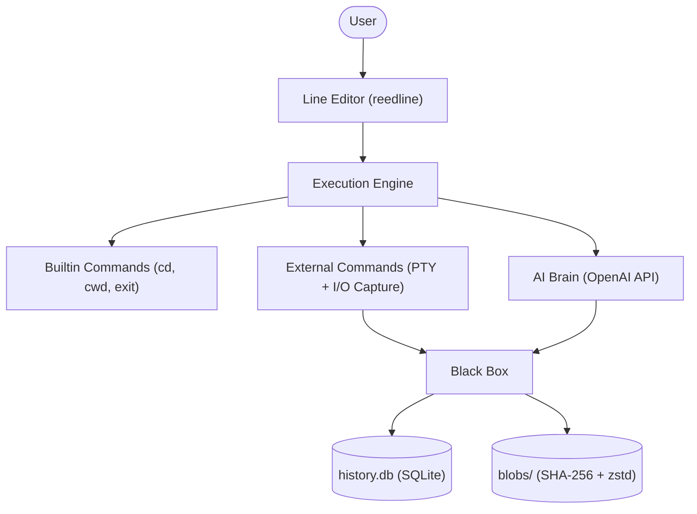

# 🤵 Jarvis Shell (jarvish)

[](https://github.com/tominaga-h/jarvis-shell/actions)


> 🌐 [日本語版 README はこちら](docs/README_JA.md)

---

## 💡 About

> _"I want J.A.R.V.I.S. as my companion — but inside my terminal."_

**Jarvish** is a **Next Generation AI Integrated Shell** written in Rust, inspired by **J.A.R.V.I.S.** from Marvel's Iron Man. It natively embeds AI intelligence into your everyday shell experience — no more copy-pasting errors into a browser. Just ask Jarvis.


---

## ✨ Features

### 🧠 AI-Powered Assistance

- 💬 Talk to Jarvis in **natural language** — right from your shell prompt
- 🔍 When a command fails, Jarvis **automatically investigates** the error using stdout/stderr context
- 🛠️ Jarvis can **read and write files**, execute commands as an AI agent with tool-calling capabilities

### 🐟 Fish-like UX

- 🎨 **Real-time syntax highlighting** as you type
- ⚡ **Auto-completion** for commands (PATH binaries, builtins) and file paths
- 📜 History-based suggestions powered by `reedline`

### 📦 The Black Box

- 🗃️ Every command execution is **persisted** — command, timestamp, working directory, exit code
- 💾 stdout/stderr outputs are stored in a **Git-like content-addressable blob storage** (SHA-256 + zstd compression)
- 🔄 Ask Jarvis about _"last week's error"_ — even after restarting the shell

### 🔧 Shell Fundamentals

- 🔀 **Pipelines** (`cmd1 | cmd2 | cmd3`)
- 📂 **Redirects** (`>`, `>>`, `<`)
- 🏠 **Tilde & variable expansion** (`~`, `$HOME`, `${VAR}`)
- 📟 Full **PTY support** for interactive programs (vim, top, etc.)

---

## 📦 Install

### Prerequisites

| Requirement           | Details                         |
| --------------------- | ------------------------------- |
| 🦀 **Rust**           | Stable toolchain (Edition 2021) |
| 🔑 **OpenAI API Key** | Required for AI features        |
| 💻 **OS**             | macOS / Linux                   |

### Install via Cargo

```bash
cargo install jarvish
```

### Build from Source

```bash
git clone https://github.com/tominaga-h/jarvis-shell.git
cd jarvis-shell
cargo install --path .
```

### Setup

Set your OpenAI API key as an environment variable:

```bash
export OPENAI_API_KEY="sk-..."
```

### Run

```bash
jarvish
```

---

## 🏗️ Architecture

Jarvish is composed of four core components:



| Component               | Description                                                                                       |
| ----------------------- | ------------------------------------------------------------------------------------------------- |
| 🖊️ **Line Editor**      | REPL interface powered by `reedline` with syntax highlighting, completion, and history            |
| ⚙️ **Execution Engine** | Routes input to builtins or external commands; captures I/O via PTY teeing                        |
| 📦 **Black Box**        | Persists all execution history and outputs (SQLite index + content-addressable blob store)        |
| 🧠 **AI Brain**         | Classifies input as command vs. natural language; provides context-aware AI assistance via OpenAI |

---

## 🛠️ Tech Stack

| Category    | Crate            | Purpose                                |
| ----------- | ---------------- | -------------------------------------- |
| Line Editor | `reedline`       | Fish-like interactive line editing     |
| Process     | `os_pipe`, `nix` | I/O capture, PTY management            |
| Async       | `tokio`          | Async runtime                          |
| Database    | `rusqlite`       | SQLite for command history             |
| Hashing     | `sha2`           | SHA-256 content hashing                |
| Compression | `zstd`           | Blob compression                       |
| AI          | `async-openai`   | OpenAI API client                      |
| Paths       | `directories`    | XDG-compliant path resolution          |
| Terminal    | `nu-ansi-term`   | ANSI color styling                     |
| Logging     | `tracing`        | Structured logging with daily rotation |

---

## 👩‍💻 Development

### Git Hooks

```bash
make install-hooks   # Install pre-push hook
make uninstall-hooks # Remove pre-push hook
```

### Run Checks

```bash
make check  # Run format, clippy, check, and test
```

### CI Pipeline (GitHub Actions)

The CI runs on every push and PR to `main`:

| Job       | Command                                     |
| --------- | ------------------------------------------- |
| ✅ Check  | `cargo check --all-targets`                 |
| 🧪 Test   | `cargo test --all-targets`                  |
| 📐 Format | `cargo fmt --all -- --check`                |
| 📎 Clippy | `cargo clippy --all-targets -- -D warnings` |
