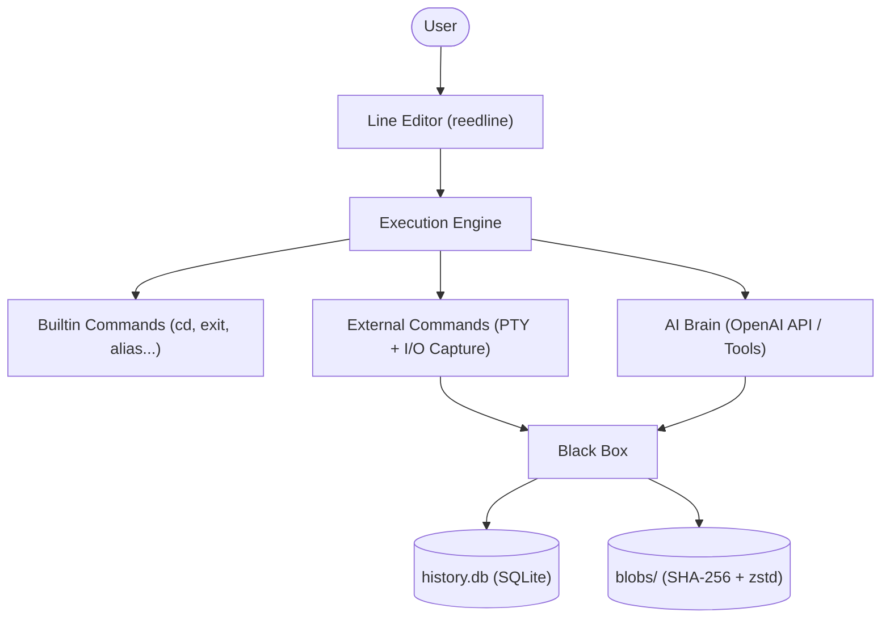

# 🤵 Jarvish — The AI-Native Shell

[](https://github.com/tominaga-h/jarvis-shell/actions)
[](https://github.com/tominaga-h/jarvis-shell/releases/tag/v1.8.3)

> 🌐 [日本語版 README はこちら](docs/README_JA.md)

## 💡 About

> _"I want J.A.R.V.I.S. as my companion — but inside my terminal."_

**Jarvish** is a **Next Generation AI Integrated Shell** written in Rust, inspired by **J.A.R.V.I.S.** from Marvel's Iron Man.

It is not just a wrapper around existing shells (Bash, Zsh) or an external tool. Jarvish deeply integrates AI into your terminal workflow itself, delivering an unprecedented experience where **you can seamlessly switch between regular commands and natural language** as naturally as breathing.

The days of copy-pasting errors into a browser to ask AI are over. Just ask Jarvish.

[](https://asciinema.org/a/806755)

## 📑 Table of Contents

- [About](#-about)
- [Core Experience](#-core-experience)
  - [Your Personal Assistant, Living in the Terminal](#1-your-personal-assistant-living-in-the-terminal)
  - [AI Pipe & AI Redirect (The Ultimate Text Processor)](#2-ai-pipe--ai-redirect-the-ultimate-text-processor)
  - ["The Black Box" (Total Recall Storage)](#3-the-black-box-total-recall-storage)
  - [Uncompromising "Blazing Fast" Shell UX](#4-uncompromising-blazing-fast-shell-ux)
- [Install](#-install)
- [Setup and Configuration](#️-setup-and-configuration)
  - [Starship Prompt Integration](#starship-prompt-integration)
- [Architecture](#️-architecture)
- [Development](#-development)

## ✨ Core Experience

### 1. Your Personal Assistant, Living in the Terminal

- **Natural Language Execution**: Just type "show me the list of active ports" at the prompt, and Jarvish translates it into the optimal command and executes it.
- **Smart Error Handling**: When a command fails, Jarvish reads the `stdout`/`stderr` context and automatically analyzes the cause and suggests solutions.
- **Autonomous Agent**: More than just a chatbot — Jarvish can read/write files and re-execute commands on its own (Tool Calls).

### 2. AI Pipe & AI Redirect (The Ultimate Text Processor)

No more struggling to remember complex `awk`, `sed`, or `jq` syntax.

- **AI Pipe (`| ai "..."`)**: Filter and transform command output directly using natural language.
  ```bash
  ls -la | ai "what is the most heavy file?"
  docker ps | ai "output the container IDs and image names as JSON"
  ```
- **AI Redirect (`> ai "..."`)**: Send command output to Jarvish's context for interactive analysis.
  ```bash
  git log --oneline -10 > ai "summarize the intent of recent commits"
  eza --help > ai "what options can be used with --tree?"
  ```

### 3. "The Black Box" (Total Recall Storage)

Jarvish remembers everything that happens in your terminal.

- **Git-like History Storage**: Every command, timestamp, directory, exit code, and full `stdout`/`stderr` output is persisted in a content-addressable blob storage (SHA-256 + zstd compression).
- **Time-Traveling Context**: Even after restarting the shell, you can ask Jarvish "what caused that error yesterday?"
- **Security**: Sensitive information such as API keys or tokens (e.g., those in `.bashrc`) is automatically **masked** before being saved.

### 4. Uncompromising "Blazing Fast" Shell UX

Despite deep AI integration, Jarvish leverages Rust's strengths to deliver outstanding performance as an infrastructure tool.

- **Async Background Prompt**: Git status scanning runs in a separate thread (using the Stale-While-Revalidate pattern), achieving **zero UI jitter** regardless of repository size.
- **Fish-like Autocomplete**: Real-time syntax highlighting with powerful auto-completion for PATH binaries and file paths.
- **Full PTY Support**: Interactive programs like `vim` and `top` work natively.
- **Starship Integration**: Native support for [Starship](https://starship.rs/) prompt — use your existing Starship configuration as-is.

## 🚀 Install

### Prerequisites

- **OpenAI API Key**
- **NerdFont** (recommended for prompt icons)

### Install via Homebrew (macOS)

```bash
brew tap tominaga-h/tap
brew install tominaga-h/tap/jarvish
```

### Install via Cargo

```bash
cargo install jarvish
```

### Build from Source

```bash
git clone https://github.com/tominaga-h/jarvis-shell.git
cd jarvis-shell
cargo install --path .
```

## ⚙️ Setup and Configuration

Set your OpenAI API key as an environment variable:

```bash
export OPENAI_API_KEY="sk-..."
```

> You can also configure this in the `[export]` section of `~/.config/jarvish/config.toml` for automatic setup.

### Configuration File (`config.toml`)

A default config file is automatically generated at `~/.config/jarvish/config.toml` on first launch.

```toml
[ai]
model = "gpt-4o"              # AI model to use
max_rounds = 10               # Max agent loop rounds
markdown_rendering = true     # Render AI responses as Markdown
ai_pipe_max_chars = 50000     # Max characters for AI Pipe input (fail-fast on overflow)
ai_redirect_max_chars = 50000 # Max characters for AI Redirect input (fail-fast on overflow)
temperature = 0.5             # Response randomness
ignore_auto_investigation_cmds = ["git log", "git diff"]  # Skip auto-investigation for these commands

[alias]
g = "git"                     # Command aliases (also manageable via builtins)
ll = "eza --icons -la"

[export]
PATH = "/usr/local/bin:$PATH" # Environment variables expanded on startup
# ⚠️ Caution: Setting SHELL = "/usr/local/bin/jarvish" causes external tools
# (Cursor, VS Code, etc.) to use jarvish as their subshell, which may trigger
# mass AI auto-investigations on tool hook failures.
# Keep SHELL set to bash/zsh if you only use jarvish as an interactive shell.

[prompt]
nerd_font = true              # Set to false if NerdFont is not installed
starship = false              # Set to true to use Starship prompt (requires: starship command + ~/.config/starship.toml)

[completion]
git_branch_commands = ["checkout", "switch", "merge", "rebase", "branch", "diff", "log", "cherry-pick", "reset", "push", "fetch"]
```

> **Tip**: After changing settings, you can apply them without restarting using the `source` command:
>
> ```bash
> source ~/.config/jarvish/config.toml
> ```

### Starship Prompt Integration

Jarvish natively supports [Starship](https://starship.rs/) as an alternative prompt. When enabled, Jarvish calls `starship prompt` directly — no init scripts needed.

**Prerequisites:**

1. The `starship` command is installed and available in your PATH
2. A Starship config file exists at `~/.config/starship.toml` (or the path specified by the `STARSHIP_CONFIG` environment variable)

**Setup:**

```toml
# ~/.config/jarvish/config.toml
[prompt]
starship = true
```

Jarvish passes `--status`, `--cmd-duration`, and `--terminal-width` to `starship prompt`, so modules like `character`, `cmd_duration`, and `status` work as expected.

If `starship = true` is set but the prerequisites are not met, Jarvish falls back to the built-in prompt with a warning.

## 🏗️ Architecture

Jarvish is composed of four highly modular core components:


```mermaid
graph TB
    User(["User"]) --> A["Line Editor (reedline)"]
    A --> B["Execution Engine"]
    B --> B1["Builtin Commands (cd, exit, alias...)"]
    B --> B2["External Commands (PTY + I/O Capture)"]
    B --> D["AI Brain (OpenAI API / Tools)"]
    B2 --> C["Black Box"]
    D --> C
    C --> C1[("history.db (SQLite)")]
    C --> C2[("blobs/ (SHA-256 + zstd)")]
```

| Component            | Description                                                                                        |
| :------------------- | :------------------------------------------------------------------------------------------------- |
| **Line Editor**      | `reedline`-based REPL with async Git prompt, syntax highlighting, and history suggestions.         |
| **Execution Engine** | Parses and dispatches commands with reliable I/O capture via PTY sessions.                         |
| **Black Box**        | Storage engine for all terminal memory. Hybrid architecture of SQLite and compressed blob storage. |
| **AI Brain**         | Classifies intent (natural language vs. command) and drives a context-aware autonomous agent loop. |

## 👩‍💻 Development

### Git Hooks

For safe development, we provide pre-push hooks.

```bash
make install-hooks   # Install hooks
make uninstall-hooks # Remove hooks
```

### Code Verification (Local CI)

```bash
make check  # Run format, clippy, check, and test in one go
```

### CI Pipeline (GitHub Actions)

The following CI runs on every push and PR to `main`:

- `cargo check --all-targets`
- `cargo test --all-targets`
- `cargo fmt --all -- --check`
- `cargo clippy --all-targets -- -D warnings`
