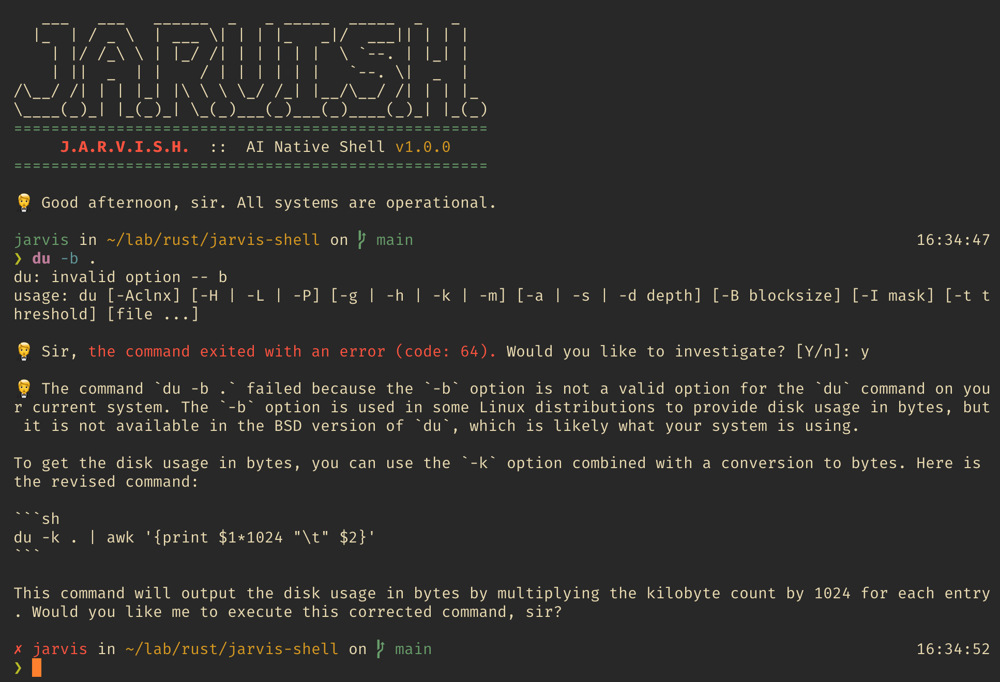
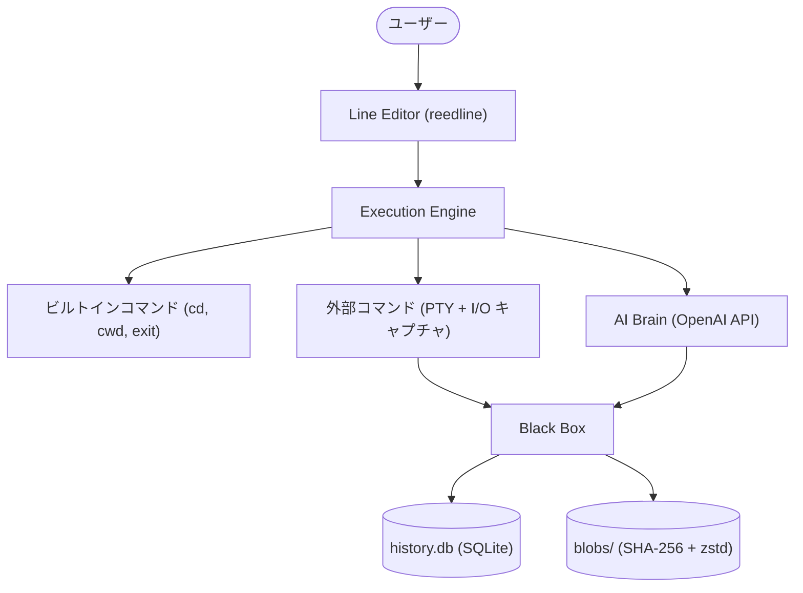

<p align="center">
  
</p>

# 🤵 Jarvis Shell (jarvish)

[](https://github.com/tominaga-h/jarvis-shell/actions)


> 🌐 [English README](../README.md)

---

## 💡 概要

> _「アイアンマンの J.A.R.V.I.S. のような相棒が欲しい。ただし、ターミナルの中で。」_

**Jarvish** は、Marvel の Iron Man に登場する **J.A.R.V.I.S.** にインスパイアされた、Rust 製の **次世代 AI 統合シェル (Next Generation AI Integrated Shell)** です。日常のシェル体験に AI の知性をネイティブに組み込みます。エラーをブラウザにコピペする必要はもうありません。Jarvis に聞くだけです。



---

## ✨ 主な機能

### 🧠 AI アシスタント

- 💬 シェルプロンプトから直接、**自然言語**で Jarvis と会話
- 🔍 コマンドが失敗すると、Jarvis が stdout/stderr のコンテキストを使って**自動的にエラーを調査**
- 🛠️ Jarvis は AI エージェントとして**ファイルの読み書き**やコマンド実行が可能（ツールコール機能）

### 🐟 Fish ライクな UX

- 🎨 入力中の**リアルタイムシンタックスハイライト**
- ⚡ コマンド（PATH バイナリ、ビルトイン）とファイルパスの**オートコンプリート**
- 📜 `reedline` による履歴ベースのサジェスト

### 📦 The Black Box

- 🗃️ すべてのコマンド実行が**永続化** — コマンド、タイムスタンプ、作業ディレクトリ、終了コード
- 💾 stdout/stderr の出力は **Git ライクなコンテンツアドレッサブル Blob ストレージ**に保存（SHA-256 + zstd 圧縮）
- 🔄 シェルを再起動しても、*「先週のエラー」*について Jarvis に相談可能

### 🔧 シェルの基本機能

- 🔀 **パイプライン** (`cmd1 | cmd2 | cmd3`)
- 📂 **リダイレクト** (`>`, `>>`, `<`)
- 🏠 **チルダ・変数展開** (`~`, `$HOME`, `${VAR}`)
- 📟 対話型プログラム（vim, top 等）のための完全な **PTY サポート**

---

## 📦 インストール

### 前提条件

| 必要なもの             | 詳細                                                   |
| ---------------------- | ------------------------------------------------------ |
| 🦀 **Rust**            | Stable ツールチェイン（Edition 2021）                  |
| 🔑 **OpenAI API キー** | AI 機能に必要                                          |
| 💻 **OS**              | macOS / Linux                                          |
| 🔤 **NerdFont**        | プロンプトアイコン表示に推奨（設定で無効化可能）       |

### Cargo でインストール

```bash
cargo install jarvish
```

### ソースからビルド

```bash
git clone https://github.com/tominaga-h/jarvis-shell.git
cd jarvis-shell
cargo install --path .
```

### セットアップ

OpenAI API キーを環境変数に設定してください：

```bash
export OPENAI_API_KEY="sk-..."
```

### 設定ファイル

Jarvish は `~/.config/jarvish/config.toml` に TOML 形式の設定ファイルを使用します。
初回起動時にデフォルトの設定ファイルが自動生成されます。

```toml
[ai]
model = "gpt-4o"        # 使用する AI モデル
max_rounds = 10          # エージェントループの最大ラウンド数

[alias]
g = "git"                # コマンドエイリアス
ll = "ls -la"

[export]
PATH = "/usr/local/bin:$PATH"   # 起動時に設定する環境変数

[prompt]
nerd_font = true         # NerdFont 未インストールの場合は false に設定
```

| セクション | 説明                                                                           |
| ---------- | ------------------------------------------------------------------------------ |
| `[ai]`     | AI モデル名とエージェントループ上限                                            |
| `[alias]`  | コマンドエイリアス（`alias` / `unalias` ビルトインでも管理可能）               |
| `[export]` | 起動時に適用する環境変数（`$VAR` 展開に対応）                                  |
| `[prompt]` | プロンプト表示設定（`nerd_font = false` で NerdFont アイコンを無効化）         |

> **ヒント**: `source` ビルトインコマンドで設定を実行中に再読み込みできます：
> ```bash
> source ~/.config/jarvish/config.toml
> ```

### 起動

```bash
jarvish
```

---

## 🏗️ アーキテクチャ

Jarvish は4つのコアコンポーネントで構成されています：



| コンポーネント          | 説明                                                                                         |
| ----------------------- | -------------------------------------------------------------------------------------------- |
| 🖊️ **Line Editor**      | `reedline` による REPL インターフェース。シンタックスハイライト、補完、履歴機能を提供        |
| ⚙️ **Execution Engine** | 入力をビルトインコマンドまたは外部コマンドに振り分け、PTY テーイングで I/O をキャプチャ      |
| 📦 **Black Box**        | すべての実行履歴と出力を永続化（SQLite インデックス + コンテンツアドレッサブル Blob ストア） |
| 🧠 **AI Brain**         | 入力をコマンド/自然言語に分類し、OpenAI を通じてコンテキストを踏まえた AI アシスタンスを提供 |

---

## 🛠️ 技術スタック

| カテゴリ         | クレート         | 用途                                 |
| ---------------- | ---------------- | ------------------------------------ |
| ラインエディタ   | `reedline`       | Fish ライクな対話型行編集            |
| プロセス管理     | `os_pipe`, `nix` | I/O キャプチャ、PTY 管理             |
| 非同期ランタイム | `tokio`          | 非同期ランタイム                     |
| データベース     | `rusqlite`       | コマンド履歴用 SQLite                |
| ハッシュ         | `sha2`           | SHA-256 コンテンツハッシュ           |
| 圧縮             | `zstd`           | Blob 圧縮                            |
| AI               | `async-openai`   | OpenAI API クライアント              |
| パス解決         | `directories`    | XDG 準拠のパス解決                   |
| ターミナル       | `nu-ansi-term`   | ANSI カラースタイリング              |
| ロギング         | `tracing`        | 日次ローテーション付き構造化ロギング |

---

## 👩‍💻 開発

### Git Hooks

```bash
make install-hooks   # pre-push フックをインストール
make uninstall-hooks # pre-push フックを削除
```

### チェック実行

```bash
make check  # format, clippy, check, test を一括実行
```

### CI パイプライン (GitHub Actions)

すべての push と `main` への PR で CI が実行されます：

| ジョブ    | コマンド                                    |
| --------- | ------------------------------------------- |
| ✅ Check  | `cargo check --all-targets`                 |
| 🧪 Test   | `cargo test --all-targets`                  |
| 📐 Format | `cargo fmt --all -- --check`                |
| 📎 Clippy | `cargo clippy --all-targets -- -D warnings` |
