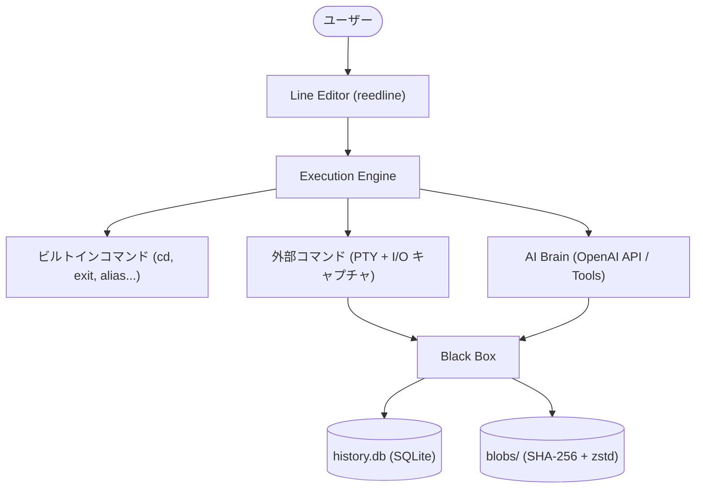

# 🤵 Jarvish — The AI-Native Shell

[](https://github.com/tominaga-h/jarvis-shell/actions)
[](https://github.com/tominaga-h/jarvis-shell/releases/tag/v1.3.0)

> 🌐 [English README](../README.md)

## 💡 概要

> _「アイアンマンの J.A.R.V.I.S. のような相棒が欲しい。ただし、ターミナルの中で。」_

**Jarvish** は、Marvel の Iron Man に登場する **J.A.R.V.I.S.** にインスパイアされた、Rust 製の **次世代 AI 統合シェル (Next Generation AI Integrated Shell)** です。

既存のシェル（BashやZsh）の単なるラッパーや外部ツールではありません。ターミナルのワークフローそのものにAIを深く統合し、**「通常のコマンド」と「自然言語」を息をするようにシームレスに行き来できる**これまでにない体験を提供します。

エラーをブラウザにコピペしてAIに聞く時代は終わりました。Jarvish に聞くだけです。

[](https://asciinema.org/a/806755)

## 📑 目次

- [概要](#-概要)
- [コア・エクスペリエンス](#-コアエクスペリエンス)
  - [ターミナルに住む、あなたの専属アシスタント](#1-ターミナルに住むあなたの専属アシスタント)
  - [AIパイプ ＆ AIリダイレクト](#2-aiパイプ--aiリダイレクト最強のテキスト処理)
  - ["The Black Box"](#3-the-black-box完全記憶型ストレージ)
  - [妥協のない「爆速」シェル UX](#4-妥協のない爆速シェル-ux)
- [インストール](#-インストール)
- [セットアップと設定](#️-セットアップと設定)
- [アーキテクチャ](#️-アーキテクチャ)
- [開発への参加](#-開発への参加)

## ✨ コア・エクスペリエンス

### 1. ターミナルに住む、あなたの専属アシスタント

- **自然言語による直接実行**: プロンプトから日本語で「今動いてるポート一覧を見せて」と打つだけで、最適なコマンドに翻訳して実行します。
- **スマートエラーハンドリング**: コマンドが失敗すると、Jarvish が直前の `stdout`/`stderr` のコンテキストを読み取り、自動的に原因を分析・解決案を提示します。
- **自律的なエージェント機能**: 単なるチャットではなく、Jarvish 自身がファイルの読み書きやコマンドの再実行を行うことができます（Tool Calls）。

### 2. AIパイプ ＆ AIリダイレクト（最強のテキスト処理）

`awk` や `sed`、`jq` の複雑なシンタックスを思い出す必要はもうありません。

- **AI パイプ (`| ai "..."`)**: コマンドの出力を自然言語で直接フィルタリング・整形します。
  ```bash
  ls -la | ai "一番重いファイルは？"
  docker ps | ai "コンテナIDとイメージ名をJSONで出力して"
  ```
- **AI リダイレクト (`> ai "..."`)**: コマンドの出力をJarvishのコンテキストに送り、対話的な分析を依頼します。
  ```bash
  git log --oneline -10 > ai "最近のコミットの変更意図を要約して"
  eza --help > ai "--treeオプションに追加で指定できるオプションは？"
  ```

### 3. "The Black Box"（完全記憶型ストレージ）

Jarvish はターミナルで起きたすべての出来事を記憶しています。

- **Gitライクな履歴保存**: 実行したコマンド、タイムスタンプ、ディレクトリ、終了コード、そして `stdout`/`stderr` の全出力結果を、コンテンツアドレッサブルなBlobストレージ（SHA-256 + zstd 圧縮）に永続化します。
- **時間を遡るコンテキスト**: シェルを再起動しても、「昨日発生したあのエラーの原因は何だっけ？」とJarvishに質問できます。
- **セキュリティ**: `.bashrc` などに含まれる可能性のある APIキー や トークン などの機密情報は、保存時に自動で **マスキング** される安全設計です。

### 4. 妥協のない「爆速」シェル UX

AIを統合しながらも、Rustの特性を活かし、インフラツールとしての圧倒的なパフォーマンスを誇ります。

- **非同期バックグラウンド・プロンプト**: Gitのステータススキャンを別スレッドで処理し（Stale-While-Revalidate パターン採用）、どれだけ巨大なリポジトリでもタイピングの遅延（UIジッター）を**完全にゼロ**にしました。
- **Fishライクなオートコンプリート**: リアルタイムなシンタックスハイライトと、PATHバイナリやファイルパスの強力な自動補完機能を備えています。
- **完全な PTY サポート**: `vim` や `top` などの対話型プログラムもネイティブに動作します。

## 🚀 インストール

### 前提条件

- **OpenAI API キー**
- **NerdFont** (プロンプトのアイコン表示に推奨)

### Homebrew でインストール (macOS)

```bash
brew tap tominaga-h/tap
brew install tominaga-h/tap/jarvish
```

### Cargo でインストール

```bash
cargo install jarvish
```

### ソースからビルド

```bash
git clone https://github.com/tominaga-h/jarvis-shell.git
cd jarvis-shell
cargo install --path .
```

## ⚙️ セットアップと設定

OpenAI API キーを環境変数に設定してください：

```bash
export OPENAI_API_KEY="sk-..."
```

> ※ `~/.config/jarvish/config.toml` の `[export]` セクションに記述することで自動設定も可能です。

### 設定ファイル (`config.toml`)

初回起動時に `~/.config/jarvish/config.toml` にデフォルト設定が自動生成されます。

```toml
[ai]
model = "gpt-4o"              # 使用する AI モデル
max_rounds = 10               # エージェントの自律ループ最大回数
markdown_rendering = true     # AIの回答をMarkdownで綺麗に表示
ai_pipe_max_chars = 50000     # AIパイプへの入力文字数上限（超過時は安全にFail-fast）
ai_redirect_max_chars = 50000 # AIリダイレクトへの入力文字数上限（超過時は安全にFail-fast）
temperature = 0.5             # 回答のランダム性
ignore_auto_investigation_cmds = ["git log", "git diff"]  # 自動調査をスキップするコマンド

[alias]
g = "git"                     # コマンドエイリアス（ビルトインでも管理可）
ll = "eza --icons -la"

[export]
PATH = "/usr/local/bin:$PATH" # 起動時に展開される環境変数

[prompt]
nerd_font = true              # NerdFont 未インストールの場合は false に設定
```

> **ヒント**: 設定を変更した後は、`source` コマンドで再起動せずに適用できます。
>
> ```bash
> source ~/.config/jarvish/config.toml
> ```

## 🏗️ アーキテクチャ

Jarvish は、高度にモジュール化された4つのコアコンポーネントで構成されています。


```mermaid
graph TB
    User(["ユーザー"]) --> A["Line Editor (reedline)"]
    A --> B["Execution Engine"]
    B --> B1["ビルトインコマンド (cd, exit, alias...)"]
    B --> B2["外部コマンド (PTY + I/O キャプチャ)"]
    B --> D["AI Brain (OpenAI API / Tools)"]
    B2 --> C["Black Box"]
    D --> C
    C --> C1[("history.db (SQLite)")]
    C --> C2[("blobs/ (SHA-256 + zstd)")]
```

| コンポーネント       | 役割                                                                                   |
| :------------------- | :------------------------------------------------------------------------------------- |
| **Line Editor**      | `reedline` ベースのREPL。非同期Gitプロンプト、ハイライト、履歴サジェストを提供。       |
| **Execution Engine** | コマンドのパース、ディスパッチ、そしてPTYセッションを用いた確実なI/Oキャプチャを実行。 |
| **Black Box**        | ターミナルの全記憶を司るストレージエンジン。SQLiteと圧縮Blobのハイブリッド構造。       |
| **AI Brain**         | 自然言語/コマンドの意図分類と、コンテキストを理解した自律的エージェントループを駆動。  |

## 👩‍💻 開発への参加

### Git Hooks のセットアップ

安全な開発のために、pre-push フックを提供しています。

```bash
make install-hooks   # フックをインストール
make uninstall-hooks # フックを削除
```

### コードの検証（CIローカル実行）

```bash
make check  # format, clippy, check, test を一括実行して安全性を確認
```

### CI パイプライン (GitHub Actions)

すべての Push と `main` への Pull Request で以下のCIが実行されます：

- `cargo check --all-targets`
- `cargo test --all-targets`
- `cargo fmt --all -- --check`
- `cargo clippy --all-targets -- -D warnings`
